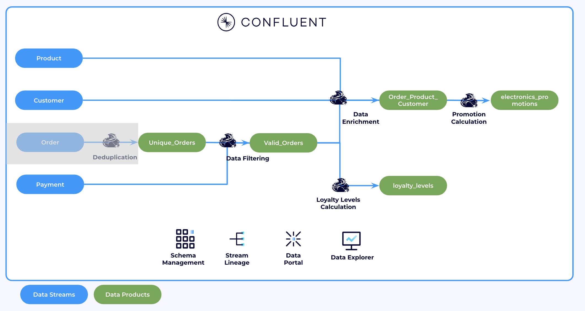
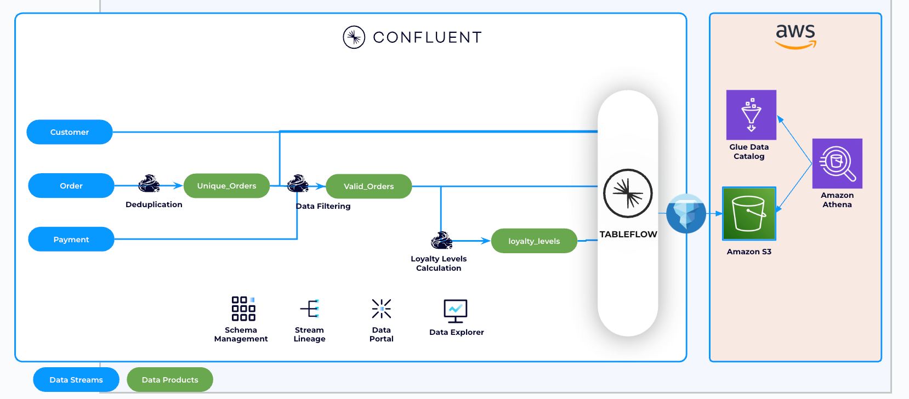

[](https://confluent.cloud/signup?utm_source=github&utm_medium=banner&utm_campaign=oss-repos&utm_term=confluent-cloud-flink-workshop)

# Flink Confluent Cloud for Apache Flink Online Store Workshop

**Duration**: ~60–90 minutes (Labs 1–2 ~60 min; add ~35 min for the optional Tableflow labs)

**Difficulty**: Beginner–Intermediate

**Technical Requirements**: Basic SQL. For the self-service path you also need a Confluent Cloud account, Terraform, and Git. The Tableflow labs additionally require access to an AWS account.

**Workshop Type**: This workshop runs in two modes — pick the one that matches your situation:

- [🎓 Instructor-Led](#-instructor-led) — your account is pre-provisioned; just claim it and start querying.
- [🛠️ Self-Service](#️-self-service) — provision your own environment with Terraform.

## 📖 Overview

This workshop simulates data for a third-party reseller offering products from major vendors like Amazon and Walmart. You'll use Confluent Cloud for Apache Flink to clean, transform, and join streaming data, ultimately creating several data products. Below is the architecture of what you'll build in Labs 1 and 2.



In Labs 3 and 4 (optional), you sync these data products to Amazon S3 in Apache Iceberg format using Tableflow, and query them with AWS Athena:



## 🗄 Datasets

All topics are generated inside your environment by Flink data-generation statements (sourced from Confluent's `examples.marketplace` catalog) — you don't produce them yourself.

| Topic | Description |
|-------|-------------|
| `clicks` | Customer clicks, including product and action details |
| `customers` | Customer CRM data (contains PII) |
| `customer_inquiries` | Customer inquiries associated with orders |
| `order_status` | Order status: `CREATED`, `PAID`, `SHIPPED`, `DELIVERED` |
| `orders` | Real-time order transactions (billing system) |
| `payments` | Payments, associated with specific orders |
| `products` | Product catalog data |

## 🔬 Workshop Labs

Choose the path that matches your situation. The hands-on Flink SQL labs (Lab 1 onward) are **identical** across modes — only how you get an environment differs.

### 🎓 Instructor-Led

> Your Confluent Cloud environment — Kafka cluster, topics, Schema Registry, Flink pools, and streaming data — is **pre-provisioned**. 
>
> You claim an account, log in, and go straight to writing Flink SQL. Use this path only when directed by your workshop instructor.

| Lab | Duration | Details |
|-----|----------|---------|
| [Lab 0: Account Setup](./flink-getting-started/lab0-workshop-setup.md) | ~5 min | **Claim your account**: log in to Confluent Cloud, verify your resources, open the Flink SQL Workspace. |
| [Lab 1: Getting Started with Flink](./flink-getting-started/lab1.md) | ~30 min | **Explore and query**: tables, select queries, deduplication, aggregations, time windows, Flink jobs. |
| [Lab 2: Data Products](./flink-getting-started/lab2.md) | ~30 min | **Build data products**: promotions and loyalty levels with advanced Flink features. |
| [Lab 3: Enable Tableflow](./tableflow-labs/lab3.md) *(optional, needs AWS)* | ~20 min | **Sync to S3**: configure AWS + Confluent, publish topics as Iceberg tables. |
| [Lab 4: Query with Athena](./tableflow-labs/lab4.md) *(optional, needs AWS)* | ~15 min | **Query Iceberg**: read the Tableflow-synced tables from AWS Athena. |

### 🛠️ Self-Service

> Fully hands-on: you provision your own Confluent Cloud environment with Terraform, then run the same Flink SQL labs. Use this to learn how to run the pipeline in your own Confluent Cloud org.
>
> Terraform: [`demo-infrastructure/`](./demo-infrastructure) (single-tenant). Setup steps below.

| Lab | Duration | Details |
|-----|----------|---------|
| [Setup: Deploy with Terraform](#self-service-setup-terraform) | ~10 min | **Provision your environment**: API keys, `terraform apply`, `source env.sh`. |
| [Lab 1: Getting Started with Flink](./flink-getting-started/lab1.md) | ~30 min | **Explore and query**: tables, select queries, deduplication, aggregations, time windows, Flink jobs. |
| [Lab 2: Data Products](./flink-getting-started/lab2.md) | ~30 min | **Build data products**: promotions and loyalty levels with advanced Flink features. |
| [Lab 3: Enable Tableflow](./tableflow-labs/lab3.md) *(optional, needs AWS)* | ~20 min | **Sync to S3**: configure AWS + Confluent, publish topics as Iceberg tables. |
| [Lab 4: Query with Athena](./tableflow-labs/lab4.md) *(optional, needs AWS)* | ~15 min | **Query Iceberg**: read the Tableflow-synced tables from AWS Athena. |
| [Teardown](#tear-down-self-service) | ~5 min | **Clean up**: `terraform destroy` to remove all billable resources. |

> [!WARNING]
> **Prerequisites and cost**
>
> The **self-service** path runs `terraform apply`, which creates billable Confluent Cloud resources — run the [teardown](#tear-down-self-service) when you finish. The **Tableflow labs (3–4)** sync to Amazon S3 and have you create an S3 bucket + IAM role, so they require access to an AWS account. Instructor-led attendees are provisioned a Confluent Cloud environment only — check with your instructor whether the Tableflow labs are included.


### Additional Resources

- **[Flink Monitoring Dashboard](./flink-monitoring/README.md)** — optional Docker-based dashboard to visualize Flink jobs and Confluent Cloud metrics (both modes).

---

## Self-Service Setup (Terraform)

> This section applies to the **self-service** path only. Instructor-led attendees start at [Lab 0](./flink-getting-started/lab0-workshop-setup.md).

### Requirements

* **Confluent Cloud API Keys** - [Cloud resource management API Keys](https://docs.confluent.io/cloud/current/security/authenticate/workload-identities/service-accounts/api-keys/overview.html#resource-scopes) with Organisation Admin permissions
* **Terraform (v1.9.5+)** - The demo resources are automatically created using [Terraform](https://www.terraform.io).
* **Git CLI** - Git CLI to clone the repo
* **Confluent CLI** - Confluent CLI if Flink shell will be used.
* **Docker and Docker Compose** - Required if you want to run the optional Flink monitoring dashboard

<details>
<summary>Installing CLI tools on MAC</summary>

Install `git`, `terraform`, and `docker` by running:

```bash
brew install git terraform docker docker-compose
```

[Optional] Install `confluent` CLI by running:
```bash
brew install confluent
```


</details>


<details>
<summary>Installing CLI tools on Windows</summary>

Install `git`, `terraform`, and `docker` by running:

```powershell
winget install --id Git.Git -e
winget install --id Hashicorp.Terraform -e
winget install --id Docker.DockerDesktop -e
```
[Optional] Install `confluent` CLI by running:
```
winget install --id ConfluentInc.Confluent-CLI -e
```
</details>


<details>
<summary>Mac Setup</summary>

First, clone the repo and change directory to `demo-infrastructure`

```bash
git clone <repo_url>
cd confluent-cloud-flink-workshop/demo-infrastructure
```

In the `demo-infrastructure` directory, create a `terraform.tfvars` file to store the Confluent Cloud API keys required by Terraform. Replace the placeholders below with your own keys and `{prefix}` with your intials.

```bash
cat > ./terraform.tfvars <<EOF
confluent_cloud_api_key = "{Confluent Cloud API Key}"
confluent_cloud_api_secret = "{Confluent Cloud API Key Secret}"
prefix = "{prefix}"
EOF
```


In `demo-infrastructure` run the following commands to set up the whole demo environment

```bash
terraform init
terraform apply --auto-approve
```

Source the demo environment variables 


```bash
source env.sh
```

</details>

<details>
<summary>Windows Setup</summary>

First, clone the repo and change directory to `demo-infrastructure`

```bash
git clone <repo_url>
cd confluent-cloud-flink-workshop\demo-infrastructure
```

In the `demo-infrastructure` directory, create a `terraform.tfvars` file to store the Confluent Cloud API keys required by Terraform. Replace the placeholders below with your own keys and `{prefix}` with your intials.

```bash
echo confluent_cloud_api_key = "{Confluent Cloud API Key}" > terraform.tfvars
echo confluent_cloud_api_secret = "{Confluent Cloud API Key Secret}" >> terraform.tfvars
echo prefix = "{prefix}" >> terraform.tfvars
```

In `demo-infrastructure` run the following commands to set up the whole demo environment

```bash
terraform init
terraform apply --auto-approve
```

Source the demo environment variables 

```
call env.bat
```
</details>

When setup completes, continue to **[Lab 1: Getting Started with Flink](./flink-getting-started/lab1.md)**.

## Tear down (self-service)

In `demo-infrastructure` run the following commands to destroy the whole demo environment

```bash
terraform destroy --auto-approve
```

## Instructor / WSA (operators)

To deliver this workshop to many attendees at once, it is onboarded to the
[Workshop Setup Accelerator (WSA)](https://github.com/confluentinc/workshop-setup-accelerator),
which pre-provisions per-attendee Confluent Cloud environments and dispenses
credentials on a first-come, first-served basis.

- **Spec:** [`wsa-spec-aws.yaml`](./wsa-spec-aws.yaml) (`cloud: AWS`, one `per_account` phase).
- **Terraform:** [`terraform/`](./terraform) — a WSA-specific tree, separate from the
  single-tenant [`demo-infrastructure/`](./demo-infrastructure). The reusable Confluent
  Cloud + Flink resources live in `terraform/modules/confluent-flink-marketplace`;
  the per-account root `terraform/aws` calls the module and adds attendee
  `EnvironmentAdmin` RBAC (so each attendee can log into the Confluent Cloud UI) and
  the WSA output contract (`cc_environment_url`, `cc_environment_id`, …).
- **Isolation:** each attendee gets their own Confluent Cloud environment; there is
  no shared infrastructure.
- **Operate a run:** the operator steps for building, dispensing, and tearing down
  a WSA delivery of this workshop aren't documented publicly. If you want to run it
  on WSA, contact the maintainers / Confluent TMM.
