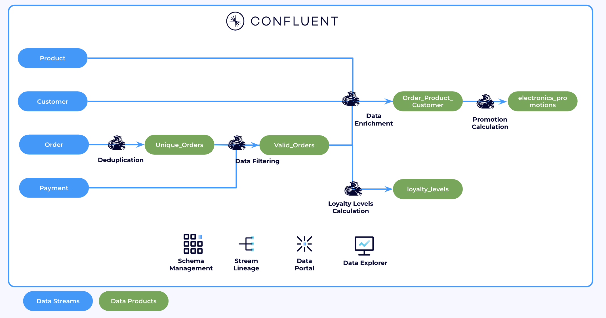

# Flink Confluent Cloud for Apache Flink Online Store Workshop

This repository sets up the necessary infrastructure for the Confluent Cloud: Getting Started with Apache Flink workshop. It simulates data for a third-party reseller offering products from major vendors like Amazon and Walmart.

During the workshop, you'll use Confluent Cloud for Apache Flink to clean, transform, and join the data, ultimately creating several data products. Below is the architecture of what you'll build.




## General Requirements

* **Confluent Cloud API Keys** - [Cloud resource management API Keys](https://docs.confluent.io/cloud/current/security/authenticate/workload-identities/service-accounts/api-keys/overview.html#resource-scopes) with Organisation Admin permissions
* **Terraform (v1.9.5+)** - The demo resources is automatically created using [Terraform](https://www.terraform.io).
* **Git CLI** - Git CLI to clone the repo 
* **Confluent CLI** - Confluent CLI if Flink shell will be used.

<details>
<summary>Installing CLI tools on MAC</summary>

Install `git` and `terraform` by running:

```bash
brew install git terraform
```

[Optional] Install `confluent` CLI by running:
```bash
brew install confluent
```


</details>


<details>
<summary>Installing CLI tools on Windows</summary>

Install `git` and `terraform` by running:

```powershell
winget install --id Git.Git -e
winget install --id Hashicorp.Terraform -e
```
[Optional] Install `confluent` CLI by running:
```
winget install --id ConfluentInc.Confluent-CLI -e
```
</details> 


## Setup

<details>
<summary>Mac Setup</summary>

First, clone the repo and change directory to `demo-infrastructure`

```bash
git clone <repo_url>
cd flink-cc-demo/demo-infrastructure
```

In the `demo-infrastructure` directory, create a `terraform.tfvars` file to store the Confluent Cloud API keys required by Terraform. Replace the placeholders below with your own keys and `{prefix}` with your intials.

```bash
cat > ./terraform.tfvars <<EOF
confluent_cloud_api_key = "{Confluent Cloud API Key}"
confluent_cloud_api_secret = "{Confluent Cloud API Key Secret}"
prefix = "{prefix}"
EOF
```


In `demo-infrastructure` run the following commands to set up the whole demo environment

```bash
terraform init
terraform apply --auto-approve
```

Source the demo environment variables 


```bash
source env.sh
```

</details>

<details>
<summary>Windows Setup</summary>

First, clone the repo and change directory to `demo-infrastructure`

```bash
git clone <repo_url>
cd confluent-cloud-flink-workshop\demo-infrastructure
```

In the `demo-infrastructure` directory, create a `terraform.tfvars` file to store the Confluent Cloud API keys required by Terraform. Replace the placeholders below with your own keys and `{prefix}` with your intials.

```bash
echo confluent_cloud_api_key = "{Confluent Cloud API Key}" > terraform.tfvars
echo confluent_cloud_api_secret = "{Confluent Cloud API Key Secret}" >> terraform.tfvars
echo prefix = "{prefix}" >> terraform.tfvars
```

In `demo-infrastructure` run the following commands to set up the whole demo environment

```bash
terraform init
terraform apply --auto-approve
```

Source the demo environment variables 

```
call env.bat
```
</details>

## Labs

**Next Lab:** [Lab 1: Getting Started with Flink](./flink-getting-started/lab1.md)


## Tear down

In `demo-infrastructure` run the following commands to destroy the whole demo environment

```bash
terraform destroy --auto-approve
```
