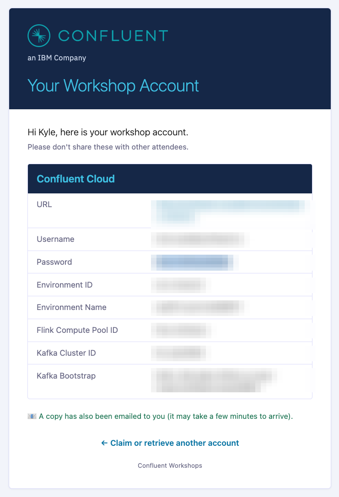

# Lab 0 — Account Setup (Instructor-Led Workshop)

**Read this only if you are attending a delivered workshop where an instructor
gives you a pre-provisioned account.** If you are running this workshop on your
own Confluent Cloud org, skip this page and follow the
[demo environment setup in the README](../README.md) instead.

At an instructor-led workshop, your Confluent Cloud environment — the Kafka
cluster, topics, Schema Registry, Flink compute pools, and the streaming data —
is **already created for you**. You do **not** clone the repo, install Terraform,
or run `terraform apply`. You just claim an account and log in.

## 1. Claim your account

Your instructor will share a link to web page where you will enter your name and email to claim an account. 

You'll receive a set of credentials - both on-screen and by email — that look like this:



Review these details about each field:

| Field | Example | What it is |
|-------|---------|------------|
| **URL** | `https://confluent.cloud/environments/env-xxxxx` | Direct link to *your* environment |
| **Username** | `tmm+wp1@confluent.io` | Your Confluent Cloud login |
| **Password** | *(provided)* | Your Confluent Cloud password |
| **Environment ID** | `env-xxxxx` | Your environment |
| **Environment Name** | `wp001-prod-a1b2c3d4` | How your environment appears in the UI |
| **Flink Compute Pool ID** | `lfcp-xxxxx` | The `default` pool you'll run queries in |
| **Kafka Cluster ID** | `lkc-xxxxx` | The `marketplace` cluster |
| **Kafka Bootstrap** | `pkc-xxxxx….confluent.cloud:9092` | Cluster bootstrap endpoint |

Keep these handy — you'll use the **URL**, **Username**, and **Password** to log
in, and the **Environment Name** to find your resources.

## 2. Log in to Confluent Cloud

1. Open [https://confluent.cloud](https://confluent.cloud) (or click your **URL**).
2. Sign in with your **Username** and **Password**.
3. You'll land in the org. Select your environment by its **Environment Name** (`wp<NNN>-prod-<id>`).

## 3. Verify your resources

Confirm the environment was provisioned correctly before you start:

- **Kafka topics** — in your environment, open the `marketplace` cluster →
  **Topics**. You should see `clicks`, `customers`, `customer_inquiries`,
  `order_status`, `orders`, `payments`, `products`.
- **Schema Registry** — each topic has a key and value schema (AVRO).
- **Flink compute pools** — open **Flink**. You should see two pools:
  - `data-generation` — runs the statements that generate the lab data (leave it alone).
  - `default` — the pool you'll use for your queries.

This is the same checklist as [Lab 1 §1](lab1.md#1-verify-confluent-cloud-resources) —
if anything is missing, tell your instructor.

## 4. Connect to Flink

**Web UI (recommended for the workshop).** In your environment, open **Flink** →
the `default` pool → **Open SQL Workspace**. No setup, no environment variables —
this is the fastest path and what the labs assume.

**SQL shell (optional).** If you prefer the `confluent` CLI, you don't have the
`env.sh` file the self-provisioned setup generates — instead export the two IDs
from your dispensed credentials, then open the shell:

```bash
# Use the values from your claimed-account credentials
export env_id="<Environment ID>"                 # e.g. env-xxxxx
export flink_compute_pool_id="<Flink Compute Pool ID>"  # e.g. lfcp-xxxxx

confluent login                                   # use your workshop Username / Password
confluent flink shell --compute-pool $flink_compute_pool_id --environment $env_id
```

## Next

You're set up. Continue with **[Lab 1 → §3 Tables](lab1.md#3-tables)** — the SQL
exercises are identical whether the environment was provisioned for you or by you.
(You can skim [Lab 1 §1–§2](lab1.md#1-verify-confluent-cloud-resources) for extra
context on the resources and connection options.)
