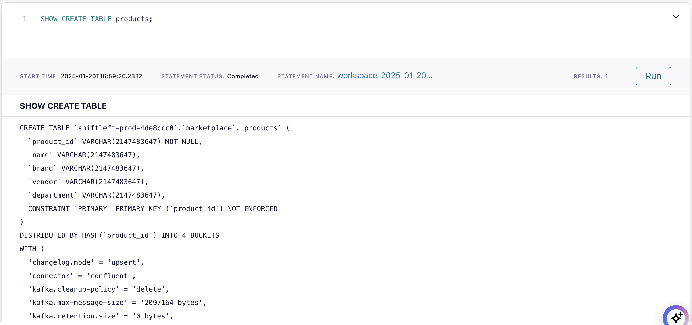

# Lab 1

This lab focuses on a third-party reseller that offers products from well-known vendors like Amazon and Walmart. In this lab, we will explore the various data sources available and begin building ad-hoc queries to aggregate the data. We will create our first data product by deduplicating `orders` data.

In Lab 2, we will dive into more advanced features of Flink and create few **Data Products** on **Promotions** and **Loyalty levels**.

The below is the full architecture of what we will build in both labs.


## Prerequisites

All required resources in Confluent Cloud must be already created for this lab to work correctly. If you haven't already, please follow the [Demo environment setup](../README.md).

## Content of Lab 1

[1. Verify Confluent Cloud Resources](lab1.md#1-verify-confluent-cloud-resources)

[2. Connecting to Flink](lab1.md#2-connecting-to-flink)

[3. Tables](lab1.md#3-tables)

[4. Select Queries](lab1.md#4-select-queries)

[5. Deduplication](lab1.md#5-deduplication)

[6. EXPLAIN Statements](lab1.md#6-explain-statements)

[7. Aggregations](lab1.md#7-aggregations)

[8. Time Windows](lab1.md#8-time-windows)

[9. Flink Jobs](lab1.md#9-flink-jobs)

## 1. Verify Confluent Cloud Resources
Let's verify if all resources were created correctly and we can start using them.

### Kafka Topics
Check if the following topics exist in your Confluent cluster:

- **`clicks`**: Tracks customer clicks, including product and action details.  
- **`customers`**: Contains customer data (Customer CRM). 
- **`customer_inquiries`**: Contains customer inquiries associated with Orders.   
- **`order_status`**: Represents the status of each order with the following possible values: `CREATED`, `PAID`, `SHIPPED`, and `DELIVERED`.  
- **`orders`**: Logs real-time order transactions (Billing System).  
- **`payments`**: Records all payments made, associated with specific orders.  
- **`products`**: Stores product data (Product Catalog).  


### Schemas in Schema Registry
For each topic, there should be a key and value schema. For example, for the `products` topic, you should have `products-value` and `products-key`. All schemas should be in `AVRO` format.

**NOTE**: The Schema Registry is at the Environment level and can be used across multiple Kafka clusters.


### Flink Compute Pool

Confluent Cloud Flink Compute Pool is a managed environment that provides the resources needed to run Apache Flink jobs directly within Confluent Cloud. It eliminates the need for self-managed Flink clusters by offering a scalable, serverless compute layer for stream processing and real-time analytics on data in Confluent topics.

With Compute Pools, you don't need to manually size your workload. Simply select the maximum number of Confluent Flink Units (CFUs), and Confluent will automatically scale your resources. You are only charged for the CFUs consumed by your queries.

In [Flink UI](https://confluent.cloud/go/flink), choose the Environment and check if there are two pools created:

- **`data-generation`**: Contains the Flink statements used to generate the lab data.  
- **`default`**: the pool we will use to run the ad-hoc queries in this lab.


<details> 
<summary>[OPTIONAL] Creating a Flink Compute Pool</summary>

The Flink pools that we will use were created by terraform, you can also create them manually through the UI.

In the Confluent environment `<prefix>-prod-<random_id>`, choose the `Flink` Tab. From there we create a new compute pool:
* choose a cloud region, click `continue` and 
* enter Pool Name: `cc_flink_compute_pool` with 10 Confluent Flink Units (CFU) and 
* click `Continue` button and then `Finish`.
  
The pool will be provisioned and ready to use in a couple of moments.
AWS Pools take 1-2 minutes. Azure Pools can take 5-7 minutes.

</details>


## 2. Connecting to Flink 
You can use your web browser or SQL shell to enter Flink SQL statements.
  * **Web UI** - In [Flink UI](https://confluent.cloud/go/flink), choose the environment `<prefix>-prod-<random_id>`, then click on `Open SQL Workspace` for the `default` pool.


    


  * **SQL shell** - You could also use the the Flink SQL Shell .Copy the command out of the Compute Pool Window and execute it in your terminal (we prefer iterm2). 

    <details>
    <summary>Mac</summary>

      ```bash
      confluent flink shell --compute-pool $flink_compute_pool_id  --environment  $env_id
      ```

      </details>

    <details>
    <summary>Windows</summary>
      
      ```
      confluent flink shell --compute-pool %flink_compute_pool_id% --environment %env_id%
      ```
      </details>

* **Data Portal**: Flink Compute Pool could also be access from the Data Portal as shown below. 

  In [Confluent Cloud UI](https://confluent.cloud/home), click on `Data Portal` in the main menu on the left side. Then select the Environment. You should see your topics. When you click on any of the topic tiles you can query the topic's data using Flink. 

  Data Portal: `products` topic selected. Click on `Query` button to access your Flink Compute Pool.

  


## 3. Tables
Let's start with exploring our tables.
Kafka topics and schemas are always in sync with the metadata in Flink's catalog. Any topic created in Kafka is visible directly as a table in Flink, and any table created via Flink is backed by a topic in Kafka. Effectively, Flink provides a SQL interface on top of Confluent Cloud.

Following mappings exist:
| Kafka          | Flink     | 
| ------------   |:---------:|
| Environment    | Catalog   | 
| Cluster        | Database  |
| Topic + Schema | Table     |

We will now work in the default SQL Workpace using `default` Flink Compute Pool:


Make sure you set with the right default  catalog (=environment) and database (=`marketplace`).


If you are using console client you can set your default catalog and database via:
```
USE CATALOG <MY CONFLUENT ENVIRONMENT NAME>;
```
```
USE <MY CONFLUENT KAFKA CLUSTER NAME>;
```

Check if you can see your catalog (=Environment) and databases (=Kafka Clusters):
```
SHOW CATALOGS;
```
```
SHOW DATABASES;
```

List all tables (=Kafka topics) in this database (=Kafka Cluster):
```
SHOW TABLES;
```
Do you see tables `clicks`,`customers`,`order_status`,`orders`,`payments`,`customer_inquiries` and `products`


You can add more Workspace cells by clicking the `+` button on the left.


Understand how the table `products` was created:
```
SHOW CREATE TABLE products;
```



You can find more information about all parameters  [here.](https://docs.confluent.io/cloud/current/flink/reference/statements/create-table.html)

### 4. Select Queries
These tables are populated & maintained by the Flink Statements using the `data-generation` Compute Pool.

Let us first check the table schema for the `products` tables. The logical schema is inferred from the topic's schema in Schema Registry.

```sql
DESCRIBE products;
```

Let's check if any product records exist in the table.

```sql
SELECT * FROM products;
```

Now check if the `customers` schema  exists. 

```sql
DESCRIBE customers;
```

Are there any customers whose name starts with `B` ?

```sql
SELECT * FROM customers
  WHERE `name` LIKE 'B%';
```

Check all attributes of the `orders` table including hidden attributes. This will show regular DESCRIBE and system columns.

```sql
DESCRIBE EXTENDED orders;
```

Pick any customer, and check the first 2 orders for that customer.

```sql
SELECT order_id, product_id, customer_id, $rowtime AS order_timestamp
  FROM orders
  WHERE customer_id = 3001
  LIMIT 2;
```

### 5. Deduplication

Let’s take a closer look at the orders. 

```sql
SELECT * FROM orders;
```

We need to make sure that there are no duplicated in the orders stream. We do not want to process an order twice. Let's check if we have any duplicates.

```sql
SELECT order_id, COUNT(*) FROM orders GROUP BY order_id;
```
The above Flink query counts the number of rows for each unique `order_id` in the `orders` table. The output shows that several `order_id` values appear more than once, indicating duplicates in the table. Let’s address this issue.

```sql
SELECT 
  order_id, 
  product_id, 
  customer_id, 
  price
FROM (
   SELECT * ,
          ROW_NUMBER() OVER (PARTITION BY order_id ORDER BY `$rowtime` ASC) AS rownum
   FROM orders
      )
WHERE rownum = 1;
```

 We can double-check that there are no duplicates anymore via:

```sql
SELECT order_id, COUNT(*) FROM 
(
  SELECT 
    order_id, 
    product_id, 
    customer_id, 
    price
  FROM (
    SELECT * ,
            ROW_NUMBER() OVER (PARTITION BY order_id ORDER BY `$rowtime` ASC) AS rownum
    FROM orders
        )
  WHERE rownum = 1
)
GROUP BY order_id;
```

This seems to work. Let’s materialize the result. (Alternative, you can also use the “Deduplicate” Flink Actions.)

```sql
SET 'client.statement-name' = 'unique-orders-maintenance';
SET 'sql.state-ttl' = '1 hour';

CREATE TABLE unique_orders 
AS SELECT 
  order_id, 
  product_id, 
  customer_id, 
  price
FROM (
   SELECT * ,
          ROW_NUMBER() OVER (PARTITION BY order_id ORDER BY `$rowtime` ASC) AS rownum
   FROM orders
      )
WHERE rownum = 1;
```

Now let's check the `unique_orders` table definition

```sql
SHOW CREATE TABLE unique_orders;
```


## Understanding the `unique_orders` Table Definition

As you can see from the `CREATE TABLE` statement, the `unique_orders` table is derived from the `orders` table using a specific transformation. This transformation employs a `ROW_NUMBER()` window function, partitioned by `order_id` and ordered by the `$rowtime` in ascending order. The subsequent `WHERE rownum = 1` clause filters the results to retain only the very first event observed for each unique `order_id` based on its timestamp.

Consequently, the resulting `unique_orders` table operates with an `append` changelog mode. This behavior arises directly from the data processing logic:

* **First Event Capture:** The query is designed to identify and persist only the earliest record for each `order_id` encountered in the `orders` stream.

* **No Subsequent Updates:** Once the initial record for an `order_id` is written to the `unique_orders` table, any subsequent events pertaining to the same `order_id` are effectively discarded by the `WHERE rownum = 1` filter. These later events, even if they contain different attribute values, do not trigger an update to the existing record in `unique_orders`.

* **Insert-Only Semantics:** The transformation logic ensures that only new, distinct `order_id` records are ever inserted into the `unique_orders` table. There is no mechanism within this query to generate update or delete operations for records that have already been processed.

With this configuration, we are essentially stating that "whenever the first `order_id` comes in, that's the one that we're emitting and keeping that forever." Even if the underlying `orders` table has a primary key defined, the transformation applied here dictates that the `unique_orders` table will only ever grow by appending new, unique `order_id` entries.

In contrast, an `upsert` mode would imply the possibility of updating existing records based on a key, and a `retract` mode would involve emitting messages to both add and remove records. The current query, by its design of selecting only the initial event for each key, inherently leads to an append-only behavior in the output table.

Therefore, the `append` changelog mode for the `unique_orders` table is a direct and logical consequence of the "first seen wins" deduplication strategy implemented in its defining query.


> NOTE: You can find more information about changelog mode [here.](https://docs.confluent.io/cloud/current/flink/concepts/dynamic-tables.html#changelog-entries)

We will now use the newly created table `unique_orders` throughout the workshop.

### 6. EXPLAIN Statements

In Flink you can use [`EXPLAIN`]() statements to show detailed information about how Flink executes a specified query or INSERT statement. We will use it show how Flink is execting the `CREATE TABLE AS SELECT` to create `unique_orders`.

```sql
EXPLAIN
CREATE TABLE unique_orders 
AS SELECT 
  order_id, 
  product_id, 
  customer_id, 
  price
FROM (
   SELECT * ,
          ROW_NUMBER() OVER (PARTITION BY order_id ORDER BY `$rowtime` ASC) AS rownum
   FROM orders
      )
WHERE rownum = 1;
```
The output should look similar to this:

```
Copy
== Physical Plan ==

StreamSink [6]
  +- StreamCalc [5]
    +- StreamRank [4]
      +- StreamExchange [3]
        +- StreamCalc [2]
          +- StreamTableSourceScan [1]

== Physical Details ==

[1] StreamTableSourceScan
Table: `jb-prod-e4d5dd72`.`marketplace`.`orders`
Primary key: (order_id)
Changelog mode: append
Upsert key: (order_id)
State size: low
Startup mode: earliest-offset

[2] StreamCalc
Changelog mode: append
Upsert key: (order_id)

[3] StreamExchange
Changelog mode: append
Upsert key: (order_id)

[4] StreamRank
Changelog mode: append
Upsert key: (order_id)
State size: medium
State TTL: never

[5] StreamCalc
Changelog mode: append
Upsert key: (order_id)

[6] StreamSink
Table: `jb-prod-e4d5dd72`.`marketplace`.`unique_orders`
Primary key: (order_id)
Changelog mode: append
Upsert key: (order_id)
State size: low
```

The above shows:
* The optimized physical execution plan
* Upsert keys and primary keys as `order_id` 
* Table source as `orders` and sink `unique_orders`


### 7. Aggregations

We can try some basic aggregations over the ` products` table.

For each brand, find the number of models and how many vendors sell this product.

```sql
SELECT brand as brand_name, 
    COUNT(DISTINCT name) as models_by_brand, 
    COUNT(DISTINCT vendor) as available_vendors
FROM products
GROUP BY brand;
```

Let's see product pages viewed more than 2 times, count the ***unique*** customers who viewed them, and calculate the average and maximum view time.

>NOTE: If there are no pages viewed more than 2 times. Check if there are any pages viewed more than once.

```sql
SELECT url as product_page, 
    COUNT(click_id) as num_of_times_viewed, 
    COUNT(DISTINCT user_id) as num_of_users,
    AVG(view_time) as avg_view_time,
    MAX(view_time) as max_view_time
FROM clicks
GROUP BY url
HAVING COUNT(click_id)  > 2;
```

The ```HAVING``` clause is used to filter results after the aggregation (i.e., after `GROUP BY` has been applied). It is similar to the `WHERE` clause, but while `WHERE` filters rows before aggregation, `HAVING` filters rows after aggregation.

>NOTE: You can find more information about Flink aggregations functions [here.](https://docs.confluent.io/cloud/current/flink/reference/functions/aggregate-functions.html)

### 8. Time Windows

Let's try Flink's time windowing table function over the `unique_orders` table.

Find the amount of orders for one minute intervals (tumbling window aggregation).

```sql
SELECT
 window_time,
 COUNT(DISTINCT order_id) AS num_orders
FROM TABLE(
   TUMBLE(TABLE unique_orders, DESCRIPTOR(`$rowtime`), INTERVAL '1' MINUTES))
GROUP BY window_start, window_end, window_time;
```
In a window operation, we should always `GROUP BY` `window_start`, `window_end` and `window_time` (defines the rowtime column of the resulting table).

Find the amount of orders for ten minute intervals advanced by five minutes (hopping window aggregation).

```sql
SELECT
 window_start, 
 window_end,
 window_time,
 COUNT(DISTINCT order_id) AS num_orders
FROM TABLE(
   HOP(TABLE unique_orders, DESCRIPTOR(`$rowtime`), INTERVAL '5' MINUTES, INTERVAL '10' MINUTES))
GROUP BY window_start, window_end, window_time;
```
Seems like we have a very successful business.


>NOTE: You can find more information about Flink Window aggregations [here.](https://docs.confluent.io/cloud/current/flink/reference/queries/window-tvf.html)


### 9. Flink Jobs 
#### **[OPTIONAL]**

Finally, you can check which Statements are still running, which Statements failed, and which were stopped. Go to `Flink` in environments and choose `Statements`. Check what you can do here. Filter out all statuses except `Running`.


There will be statements running, one of them will be the `unique-orders-maintenance` job that we created in [5. Deduplication](lab1.md#5-deduplication) lab. Also notice the the `# Messages behind`, looks like it's keeping up with its input tables.

The rest are ongoing statements running to generate data. The other queries are running from the other compute pool.

You can also use the Confluent CLI:

<details>

  <summary>Mac</summary>

  ```bash
  confluent flink statement list --cloud aws --region $cloud_region --environment $env_id --compute-pool $flink_compute_pool_id 
  ```
</details>

<details>
<summary>Windows</summary>
  
  ```
  confluent login
  confluent flink statement list --cloud aws --region %cloud_region% --environment %env_id% --compute-pool %flink_compute_pool_id% 
  ```
</details>


```bash
          Creation Date          |                               Name                               |           Statement            | Compute Pool |  Status   |         Status Detail          |                                                                        Latest Offsets                                                                         |   Latest Offsets Timestamp     
---------------------------------+------------------------------------------------------------------+--------------------------------+--------------+-----------+--------------------------------+---------------------------------------------------------------------------------------------------------------------------------------------------------------+--------------------------------
  2025-01-24 12:24:53.077472     | workspace-2025-01-24-122447-b3bfdb16-d965-4399-be28-ea0924a6b4b9 | SELECT * FROM orders;          | lfcp-r1rw90  | STOPPED   | This statement was stopped     | orders=partition:0,offset:1681;partition:1,offset:1680                                                                                                        | 2025-01-24 12:35:04 +0000 UTC  
  +0000 UTC                      |                                                                  |                                |              |           | manually.                      |                                                                                                                                                               |                                
  2025-01-24 12:26:46.44412      | workspace-2025-01-24-122447-26f3e16f-de3a-4c95-b849-10933d217147 | SELECT order_id, product_id,   | lfcp-r1rw90  | STOPPED   | This statement was stopped     | orders=partition:0,offset:1065;partition:1,offset:1084                                                                                                        | 2025-01-24 12:29:40 +0000 UTC  
  +0000 UTC                      |                                                                  | customer_id, $rowtime AS       |              |           | manually.                      |                                                                                                                                                               |                                
                                 |                                                                  | order_timestamp   FROM orders  |              |           |                                |                                                                                                                                                               |                                
                                 |                                                                  |   WHERE customer_id = 3001     |              |           |                                |                                                                                                                                                               |                                
                                 |                                                                  | LIMIT 10;                      |              |           |                                |                                                                                                                                                               |                                
  2025-01-24 12:30:04.851375     | workspace-2025-01-24-122447-93ac1512-971f-4a0d-ac74-41fbfb56beb1 | SELECT order_id, COUNT(*) FROM | lfcp-r1rw90  | STOPPED   | This statement was stopped     | orders=partition:0,offset:1468;partition:1,offset:1485                                                                                                        | 2025-01-24 12:32:51 +0000 UTC  
  +0000 UTC                      |                                                                  | orders GROUP BY order_id;      |              |           | manually.                      |                                                                                                                                                               |                                
  2025-01-24 12:33:03.154779     | workspace-2025-01-24-122447-c7c23c3c-dfd8-4e32-bccd-b24a7f5e51e7 | SELECT    order_id,            | lfcp-r1rw90  | STOPPED   | This statement was stopped     | orders=partition:0,offset:1681;partition:1,offset:1680                                                                                                        | 2025-01-24 12:35:05 +0000 UTC  
  +0000 UTC                      |                                                                  | product_id,    customer_id,    |              |           | manually.                      |                                                                                                                                                               |                                
                                 |                                                                  |   price FROM (    SELECT * ,   |              |           |                                |                                                                                                                                                               |                                
                                 |                                                                  |           ROW_NUMBER() OVER    |              |           |                                |                                                                                                                                                               |                                
                                 |                                                                  | (PARTITION BY order_id ORDER   |              |           |                                |                                                                                                                                                               |                                
                                 |                                                                  | BY `$rowtime` ASC) AS rownum   |              |           |                                |                                                                                                                                                               |                                
                                 |                                                                  |    FROM orders       ) WHERE   |              |           |                                |                                                                                                                                                               |                                
                                 |                                                                  | rownum = 1;                    |              |           |                                |                                                                                                                                                               |                                
  2025-01-24 12:35:20.140144     | workspace-2025-01-24-122447-dabcd567-afea-463a-a24b-031e06a49fa7 | SELECT order_id, COUNT(*) FROM | lfcp-r1rw90  | STOPPED   | This statement was stopped     | orders=partition:0,offset:1766;partition:1,offset:1800                                                                                                        | 2025-01-24 12:36:38 +0000 UTC  
  +0000 UTC                      |                                                                  |  (   SELECT      order_id,     |              |           | manually.                      |                                                                                                                                                               |                                
                                 |                                                                  |  product_id,      customer_id, |              |           |                                |                                                                                                                                                               |                                
                                 |                                                                  |      price   FROM (     SELECT |              |           |                                |                                                                                                                                                               |                                
                                 |                                                                  | * ,             ROW_NUMBER()   |              |           |                                |                                                                                                                                                               |                                
                                 |                                                                  | OVER (PARTITION BY order_id    |              |           |                                |                                                                                                                                                               |                                
                                 |                                                                  | ORDER BY `$rowtime` ASC) AS    |              |           |                                |                                                                                                                                                               |                                
                                 |                                                                  | rownum     FROM orders         |              |           |                                |                                                                                                                                                               |                                
                                 |                                                                  |  )   WHERE rownum = 1 ) GROUP  |              |           |                                |                                                                                                                                                               |                                
                                 |                                                                  | BY order_id                    |              |           |                                |                                                                                                                                                               |                                
  2025-01-24 12:36:39.551536     | unique-orders-maintenance                                        |                                | lfcp-r1rw90  | RUNNING   |                                |                                                                                                                                                               | 0001-01-01 00:00:00 +0000 UTC  
  +0000 UTC                      |                                                                  |                                |              |           |                                |                                                                                                                                                               |                                
                                 |                                                                  |                                |              |           |                                |                                                                                                                                                               |                                
                                 |                                                                  |    CREATE TABLE unique_orders  |              |           |                                |                                                                                                                                                               |                                
                                 |                                                                  |  AS SELECT    order_id,        |              |           |                                |                                                                                                                                                               |                                
                                 |                                                                  | product_id,    customer_id,    |              |           |                                |                                                                                                                                                               |                                
                                 |                                                                  |   price FROM (    SELECT * ,   |              |           |                                |                                                                                                                                                               |                                
                                 |                                                                  |           ROW_NUMBER() OVER    |              |           |                                |                                                                                                                                                               |                                
                                 |                                                                  | (PARTITION BY order_id ORDER   |              |           |                                |                                                                                                                                                               |                                
                                 |                                                                  | BY `$rowtime` ASC) AS rownum   |              |           |                                |                                                                                                                                                               |                                
                                 |                                                                  |    FROM orders       ) WHERE   |              |           |                                |                                                                                                                                                               |                                
                                 |                                                                  | rownum = 1;                    |              |           |                                |                                                                                                                                                               |                                
                       
                                   
# ....
```

This is the end of Lab1, please continue with [Lab2](lab2.md).
