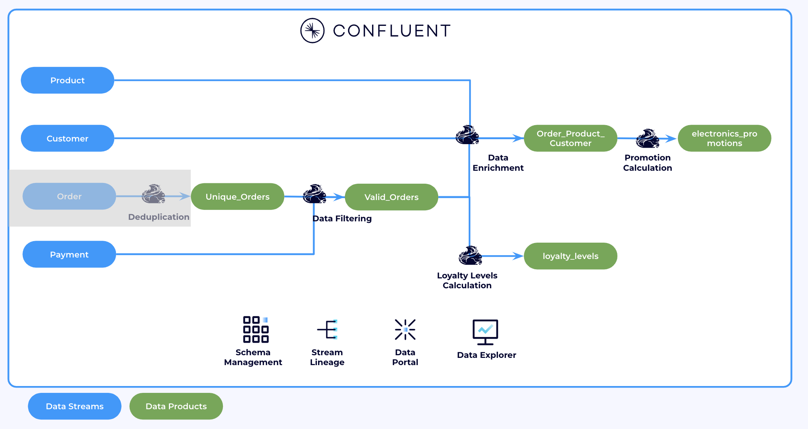
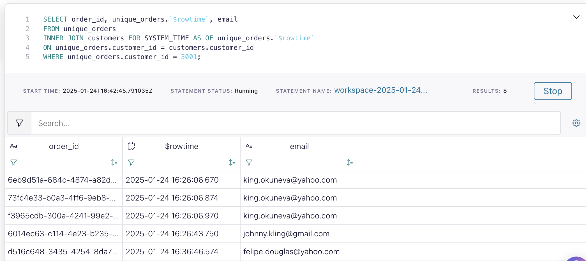
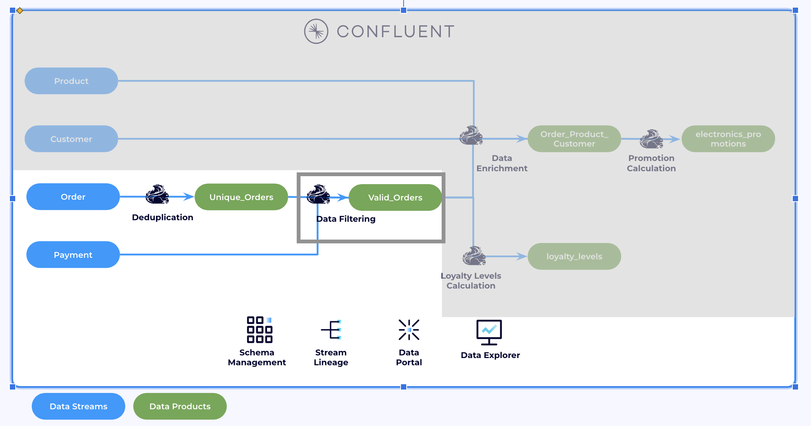
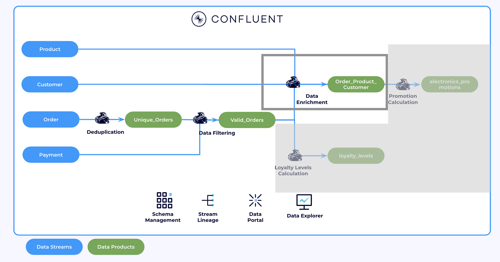
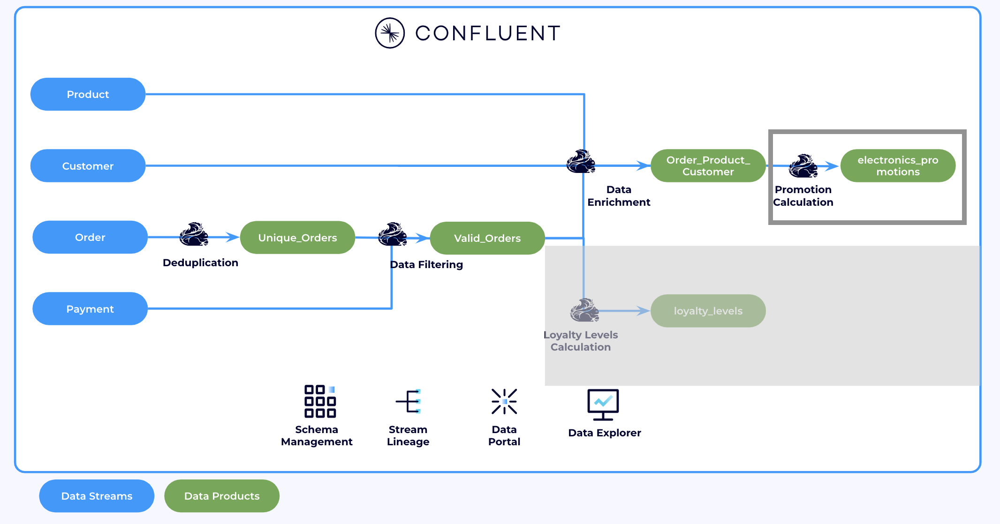
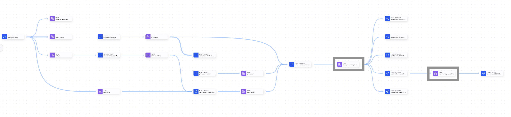
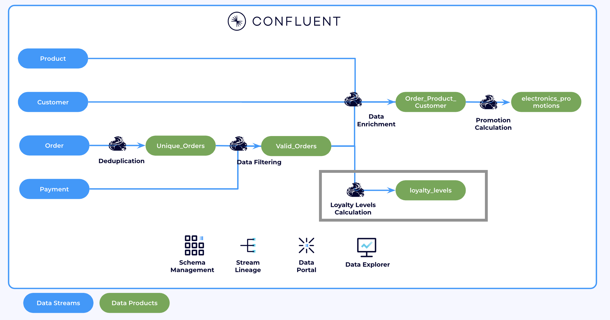

# Lab 2

In this Lab (Lab2), we will dive into more advanced features of Flink. We will use different types of joins to create few **Data Products**. First, we will filter out orders that do not have valid payments. Additionally, we will calculate customer **Promotions** and **Loyalty levels**.

Finishing Lab 1 is required for Lab 2. If you have not completed it, go back to [Lab 1](lab1.md). Below is the architecture of this lab. The dimmed part should have been created in Lab1.




[1. Flink Joins](lab2.md#1-Flink-joins)

[2. Data Enrichment](lab2.md#2-data-enrichment)

[3. Promotions Calculation](lab2.md#3-promotions-calculation)

[4. Data pipeline Observability](lab2.md#4-data-pipeline-observability)

[5. Loyalty Levels Calculation](lab2.md#5-loyalty-levels-calculation)


### 1. Flink Joins

Flink SQL supports complex and flexible join operations over dynamic tables. There are a number of different types of joins to account for the wide variety of semantics that queries may require.

> You can find more information about Flink SQL Joins [here.](https://docs.confluent.io/cloud/current/flink/reference/queries/joins.html)


Join `unique_orders` with `customer` records (regular inner join). We will pick one customer as an example, in this case it is customer with `customer_id=3001`:

```sql
SELECT /*+ STATE_TTL('unique_orders'='6h', 'customers'='2d') */ 
order_id, unique_orders.`$rowtime`, email
FROM unique_orders
INNER JOIN customers 
ON unique_orders.customer_id = customers.customer_id
WHERE unique_orders.customer_id = 3001;
```

Notice how all output rows update whenever the customer's email changes. This is expected behavior with a regular join as it doesn't have any notion of time. Like in a database, the output of a join changes for all matching rows if any of the sides of joins changes. In the context of streaming, this approach has two key disadvantages:

1. If the cardinality of one of the tables is infinity (like `orders`), the state of the join will grow indefinitely. In this case, you need a state time-to-tive (state-ttl) so that Flink can clean up state eventually.
2. Often you are looking for different join semantics, where every order is joined to the product information as of the time when the order happened and orders are never updated afterwards when the product information changes. 

 >Look at Time-to-live to limit the state size [here.](https://docs.confluent.io/cloud/current/flink/operate-and-deploy/best-practices.html#implement-state-time-to-live-ttl)
TTL Hints configuraiton examples [More info here.](https://docs.confluent.io/cloud/current/flink/reference/statements/hints.html)


A temporal join address both of these concerns, which links orders to customer records as they existed at the time when the order was created. We will do the same, use the same `customer_id=3001`. While keeping the previous cell, in a new cell run this temporal join:

```sql
SELECT order_id, unique_orders.`$rowtime`, email
FROM unique_orders
INNER JOIN customers FOR SYSTEM_TIME AS OF unique_orders.`$rowtime`
ON unique_orders.customer_id = customers.customer_id
WHERE unique_orders.customer_id = 3001;
```

Notice that whenever a customer updates their email, previous orders remain unchanged. This behavior occurs because the join is performed based on the state of the data at the time the order was placed. In the example below, when the customer updates their email from `king.okuneva@yahoo.com` to `johnny.kling@gmail`.com, earlier orders retain the original email. This ensures that orders are enriched with the customer's information as it was at the time of the order, which is the desired outcome. Therefore,**Temporal Joins** are better in for this use case.



> *Note: In real-world scenarios, customer email addresses rarely change. This update is being made for demonstration purposes.*

> NOTE: You can find more information about Temporal Joins with Flink SQL [here.](https://docs.confluent.io/cloud/current/flink/reference/queries/joins.html#temporal-joins)

#### Interval Joins

Interval joins are particularly useful when working with unbounded data streams. In our use case, an order is considered valid only if a corresponding payment is received. Since payments always occur after an order is placed, interval joins allow us to efficiently match orders with their respective payments based on time constraints.



Create a new table that will hold valid orders.

```sql
SET 'client.statement-name' = 'valid-orders-materializer';
CREATE TABLE valid_orders (
  order_id STRING,
  customer_id INT,
  product_id STRING,
  order_time TIMESTAMP_LTZ(3),
  payment_time TIMESTAMP_LTZ(3),
  amount DECIMAL,
  WATERMARK FOR order_time AS order_time - INTERVAL '5' SECOND
) AS SELECT unique_orders.order_id, customer_id, product_id, unique_orders.`$rowtime` AS order_time, payment_time, amount
FROM unique_orders
INNER JOIN payments
ON unique_orders.order_id = payments.order_id
WHERE unique_orders.`$rowtime` BETWEEN payment_time - INTERVAL '10' MINUTES AND payment_time;
```

Here we are using [CREATE TABLE AS SELECT(CTAS)](https://docs.confluent.io/cloud/current/flink/reference/statements/create-table.html#create-table-as-select-ctas) statement. Similar to `INSERT INTO AS SELECT`, CTAS statements run continuously, writing the output of the `SELECT` query into the newly created table, `valid_orders`.

Checkout records in `valid_orders`
```sql
SELECT * FROM valid_orders;
```

We will now use `valid_orders` for the rest of the workshop.

### 2. Data Enrichment


 
We will join data from: Valid Orders, Customer, Product tables together in a single SQL statement. And insert them into a new data product: `order_customer_product`

Use CTAS to create a new table for `Order <-> Customer <-> Product` join results

```sql
SET 'client.statement-name' = 'valid-orders-customer-product-materializer';
CREATE TABLE order_customer_product(
  order_id STRING,
  customer_id INT,
  name STRING,
  email STRING,
  brand STRING,
  product STRING,
  sale_price DOUBLE
)WITH (
    'changelog.mode' = 'retract'
)AS SELECT
  valid_orders.order_id,
  valid_orders.customer_id,
  customers.name,
  customers.email,
  products.brand,
  products.name AS product,
  valid_orders.amount
FROM valid_orders
  INNER JOIN customers FOR SYSTEM_TIME AS OF valid_orders.order_time
    ON valid_orders.customer_id = customers.customer_id
  INNER JOIN products FOR SYSTEM_TIME AS OF valid_orders.order_time
    ON valid_orders.product_id = products.product_id;
```

In this case, we used a temporal join to associate valid orders (orders with a successful payment) with product and customer information at the time the order was placed. A regular join is not suitable here because it would generate a new output for all orders every time the customer or product information changes. Since we are only interested in the product and customer details as they were at the time of the order, temporal joins are the ideal solution.

Verify that the data was joined successfully. 
```sql
SELECT * FROM order_customer_product;
```

Congratulions on building your first data product. Now we enriched valid orders with customer (name and email) and product (brand) information.

### 3. Promotions Calculation
#### **[ADVANCED]**



We want to run special electronics promotion. Customers that have purchased electronics from us migh be eligible for this promotion. Let's find out if there are any eligible customers.

Find which customers have ordered electronincs brands in large volumes.
```sql
SELECT
     customer_id,
     COLLECT(brand) AS products,
     'bundle_offer' AS promotion_name
  FROM order_customer_product
  WHERE brand IN ('Samsung', 'Sony', 'LG')
  GROUP BY customer_id
  HAVING COUNT(DISTINCT brand) >= 2 AND COUNT(brand) > 5;
```

This query identifies customers eligible for a "bundle_offer" promotion by analyzing their purchase history. It groups customers by email, collects the brands they purchased (Samsung, Sony, or LG), and filters for those who have purchased at least two distinct brands and more than 5 total items.  

Now we are ready to store the results for all calculated promotions. 

Create a table for promotion notifications:
```sql
CREATE TABLE electronics_promotions(
  customer_id INT,
  promotion_name STRING,
  PRIMARY KEY (customer_id) NOT ENFORCED
);
```

Write both calculated promotions in a single statement set to the `electronics_promotions` table.

```sql
SET 'client.statement-name' = 'electronics-promotions-materializer';

INSERT INTO electronics_promotions
SELECT
     customer_id,
     'bundle_offer' AS promotion_name
  FROM order_customer_product
  WHERE brand IN ('Samsung', 'Sony', 'LG')
  GROUP BY customer_id
  HAVING COUNT(DISTINCT brand) >= 2 AND COUNT(brand) > 5;

```


Check if all promotion notifications are stored correctly.
```SQL
SELECT * from electronics_promotions;
```

### 4. Data pipeline Observability

Congratulations on building your first use-case on top of our data product. Let's checkout what we have built.

In the [Conflluent Cloud Cluster UI](https://confluent.cloud/go/clusters), choose the **Environment** and **Cluster**, then navigate to the left-hand pane and click on **Stream Lineage**.

   

The two topics highlighted represent data products that can be used by other teams and consumers. The first is `order_customer_product`, and the second is `electronics_promotions`.


### 5. Loyalty Levels Calculation
#### **[ADVANCED]**



Now, we are ready to calculate loyalty levels for our customers.


For each customer, checkout the total number of orders (num_orders) and the total order value (total_price), based on the most recent hour of activity.

```sql
SELECT 
  customer_id,
  order_id,
  order_time,
  COUNT(*) OVER w AS num_orders,
  SUM(amount) OVER w AS total_price
FROM `valid_orders`
WINDOW w AS (
  PARTITION BY customer_id
  ORDER BY order_time
  RANGE BETWEEN INTERVAL '1' HOUR PRECEDING AND CURRENT ROW
);
```
Based on the query results, we determine the reward level for each customer based on their spending over the past hour. Customers are categorized as follows: those who spend more than 30K are `GOLD`, those who spend over 20K are `SILVER`, and those who spend over 10K are `BRONZE` category. We insert this information into a new table: `reward_levels`.
> Note: We used 1h as the time interval. In real-world senarios it will most probably be a month.

```sql
CREATE TABLE reward_levels (
  customer_id BIGINT, 
  total_price DOUBLE,
  rewards_level STRING,
  updated_at TIMESTAMP_LTZ(3),
  PRIMARY KEY (customer_id) NOT ENFORCED
)
AS 
WITH total_price_per_customer_1h AS 
(
SELECT 
  customer_id,
  SUM(amount) OVER w AS total_price, 
  order_time
FROM `valid_orders`
WINDOW w AS (
  PARTITION BY customer_id
  ORDER BY order_time
  RANGE BETWEEN INTERVAL '1' HOUR PRECEDING AND CURRENT ROW
)
) 
SELECT 
  COALESCE(customer_id, 0) AS customer_id, 
  total_price,
  CASE
    WHEN total_price > 30000 THEN 'GOLD'
    WHEN total_price > 20000 THEN 'SILVER'
    WHEN total_price > 10000 THEN 'BRONZE'
    ELSE 'NONE'
  END AS rewards_level,
 order_time AS updated_at
FROM total_price_per_customer_1h;
```
The query above uses the [COALESCE](https://docs.confluent.io/cloud/current/flink/reference/functions/conditional-functions.html#flink-sql-coalesce-function) function is used to ensure that `customer_id` does not contain null values, substituting a default value of 0 when `customer_id` is null. This ensures data integrity, particularly if any orders lack a valid `customer_id`.

We are also using [Common Table Expressions (CTEs)](https://docs.confluent.io/cloud/current/flink/reference/queries/with.html) - ```WITH total_price_per_customer_1h AS```. The CTE serves as a temporary result set, stored in `total_price_per_customer_1h`, that exists only for the duration of the main query. It calculates the rolling `SUM(amount)` for each `customer_id` over a 1-hour window, organizing the logic for computing total spending within this time frame.


Verify your results:
```sql
SELECT * FROM reward_levels;
```

That is the second use-case built on top of the another data product, `valid_orders`.

## End of Lab2.

# If you don't need your infrastructure anymore, do not forget to delete the resources!
Go to [destroy lab](../README.md#tear-down)
