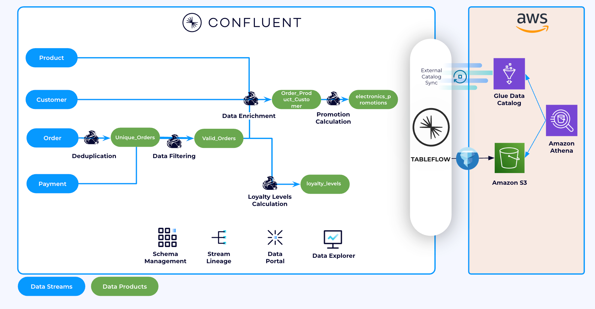

# Confluent Cloud Tableflow Labs: Overview

This set of labs is designed to guide you through the process of integrating Confluent Cloud's Tableflow feature with AWS services to seamlessly sync Kafka topic data into open table formats like Apache Iceberg, stored in Amazon S3, and queryable via AWS Athena.

## What You'll Learn

This section is divided into multiple labs, each focusing on a specific aspect of the integration. Below is a summary of **Lab 3** and **Lab 4**, which are key to enabling Tableflow and querying data from tables.

---

## Lab 3: Configure AWS and Enable Tableflow

In this lab, you'll set up the foundational AWS resources and configure Confluent Cloud to use Tableflow for syncing Kafka topic data into your S3 bucket as Iceberg tables.

### Key Steps:
1. **Create an S3 Bucket**: Set up an S3 bucket to store Iceberg tables.
2. **Configure Provider Integration**: Establish a secure connection between Confluent Cloud and your AWS account.
3. **Create IAM Policies and Roles**: Define permissions for S3 access and create an IAM role that Confluent Cloud can assume.
4. **Enable Tableflow**: Activate Tableflow for specific Kafka topics to begin syncing data to your S3 bucket.

### Outcome:
By the end of this lab, your Kafka topics will be syncing data into your S3 bucket as Iceberg tables, ready for further processing or querying.

---

## Lab 4: Integrate Tableflow with AWS Glue Catalog and Query with Athena

This lab focuses on integrating Tableflow with AWS Glue Data Catalog and querying the synced Iceberg tables using AWS Athena.

### Key Steps:
1. **Create a Glue Provider Integration**: Set up a separate IAM role and permissions for Glue access.
2. **Configure Catalog Integration**: Link Confluent Cloud to AWS Glue Data Catalog to register Iceberg tables.
3. **Query with Athena**: Use Athena to run SQL queries on the Iceberg tables synced by Tableflow.

### Outcome:
By the end of this lab, you'll be able to query your Kafka topic data stored in S3 as Iceberg tables using AWS Athena, leveraging the Glue Data Catalog for schema management.

---

## Prerequisites

Before starting these labs, ensure you have:
- Access to an AWS account with permissions to create S3 buckets, IAM policies, roles, and Glue resources.
- A Confluent Cloud account with Kafka topics ready for Tableflow.
- Completed the earlier labs in this workshop (e.g., Flink setup).

---

## Cleanup Instructions

After completing the labs, remember to clean up your resources to avoid unnecessary costs:
- **Delete S3 Buckets**: Empty and delete the S3 bucket used for Tableflow.
- **Remove IAM Policies and Roles**: Delete the IAM policies and roles created during the labs.
- **Tear Down Confluent Infrastructure**: Follow the instructions in the [Tear Down Guide](../README.md#tear-down) to delete your Confluent resources.

---

## Next Steps

- Start with [Lab 3: Configure AWS and Enable Tableflow](lab3.md).
- Proceed to [Lab 4: Integrate Tableflow with AWS Glue Catalog and Query with Athena](lab4.md).

